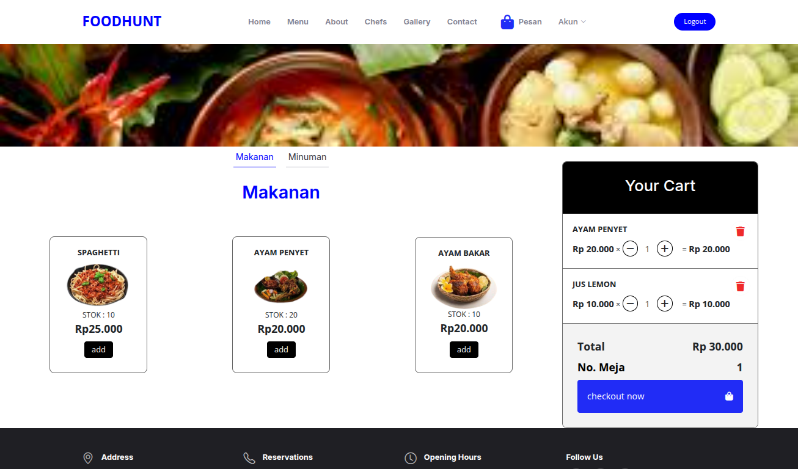
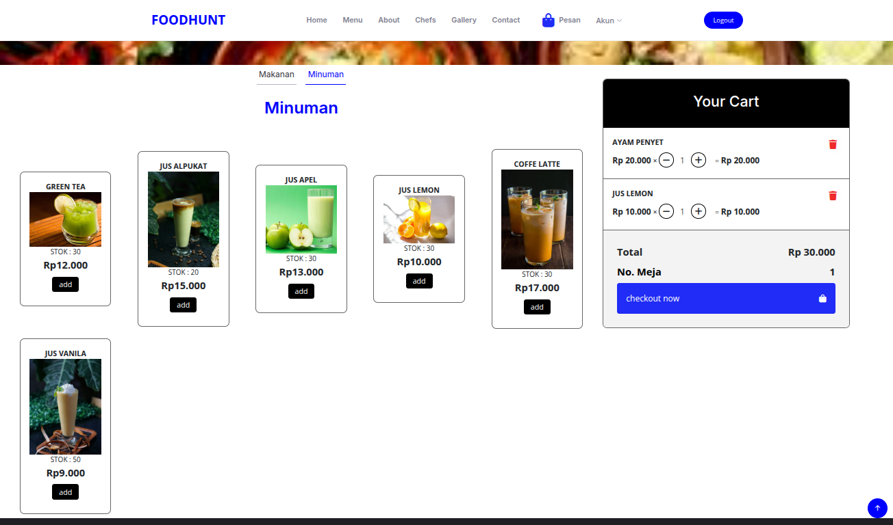

# Restaurant Menu Information System

## usage
#### Clone the repository
```bash
git clone https://github.com/moehakram/sisfo-menu-restoran.git
cd sisfo-menu-restoran
```

#### Create the database
Log in to MySQL and run the following command:
```mysql
CREATE DATABASE sisfo_menurestoran;
```

#### Import the SQL file
Import the sisfo_menurestoran.sql file into the newly created database:
```bash
mysql -u root -p sisfo_menurestoran < sisfo_menurestoran.sql
```
#### Configure the database
Edit the configuration file at config/database.json. By default, the application uses the prod environment:

```json
{  
    "prod":{
        "host" : "localhost",
        "port" : "3306",
        "dbname" : "sisfo_menurestoran",
        "dbuser" : "root",
        "dbpass" : ""
    }
}

```

#### Run the application
Use PHP's built-in server:
```bash
php -S localhost:8080 -t public
```

## Screenshots


-

